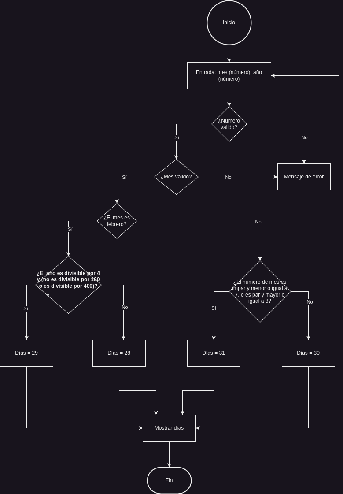

## Introducción

Temas a tratar en este blog

* ❤️[Algoritmo a desarrollar](#algoritmo-a-desarrollar)
* ❤️[Análisis](#análisis)
* ❤️[Diagrama de flujo](#diagrama-de-flujo)
* ❤️[Programa en c++](#programa-en-c)

## Algoritmo a desarrollar

Dado un mes y un año, determina cuántos días tiene ese mes. Ten en cuenta los años bisiestos para el mes de febrero.

## Análisis

Para abordar este programa, debemos hacer un análisis de lo que nos pide, descomponiendo en pasos el proceso para
determinar las etapas lógicas, las combinaciones de condiciones.

### Entradas:

* Mes: Número entero (1-12)
* Año: Número del año

### Proceso:

* Verificar si el mes es Febrero (2).
    * Si es febrero, verificamos si el año es bisiesto y así determinar si tiene 28 o 29 días.
        * Un año es bisiesto si es divisible por 4, y además, si es divisible por 100, también debe ser divisible por
          400.
    * Si el año es bisiesto, entonces días = 29, sino, días = 28
* Para otros meses, debemos determinar si tiene 30 o 31 días:
    * Usamos una condición simplificada para determinar si un mes tiene 31 días:
        * ¿El número de mes es impar y menor o igual a 7, o es par y mayor o igual a 8?
            * Si cumple, días = 31
            * Si no cumple, días = 30

### Salida

* Número de días del mes dado

## Diagrama de flujo



## Programa en c++

```cpp
#include <iostream>

int main()
{
    int month = 0;
    int year = 0;
    int days = 0;
    std::cout << "Por favor ingresa el mes (1-12): ";
    std::cin >> month;
    std::cout << "Por favor ingresa el año: ";
    std::cin >> year;

    if (month == 1 || month == 3 || month == 5 || month == 7 || month == 8 || month == 10 || month == 12)
    {
        days = 31;
    }
    else if (month == 4 || month == 6 || month == 9 || month == 11)
    {
        days = 30;
    }
    else if (month == 2)
    {
        if (year % 4 == 0 && (year % 100 != 0 || year % 400 == 0))
        {
            days = 29;
        }
        else
        {
            days = 28;
        }
    }
    else
    {
        std::cout << "Mes no válido!.\n";
        return 1;
    }

    if (days > 0)
    {
        std::cout << "Mes " << month << " del " << year << " tiene " << days << " días.\n";
    }

    return 0;
}

```